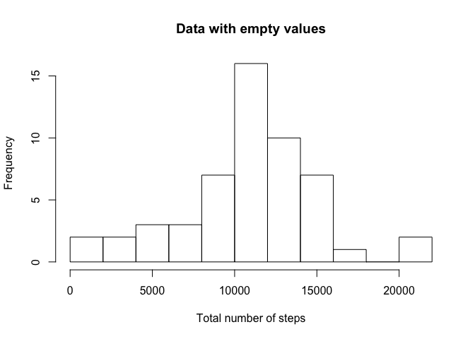
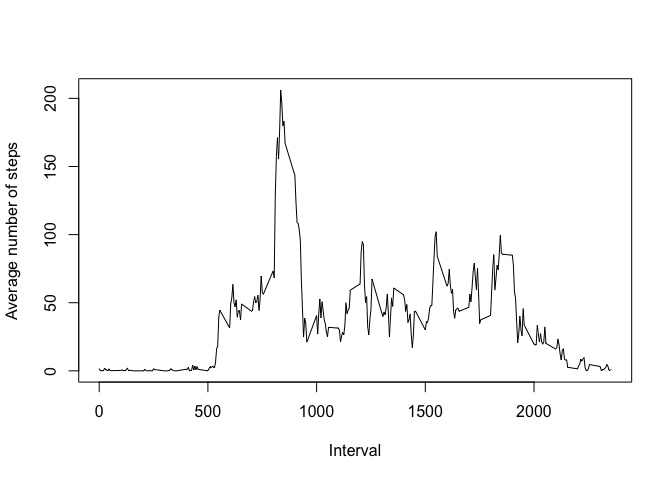
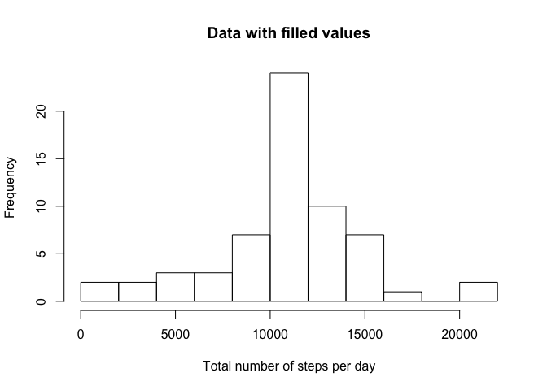
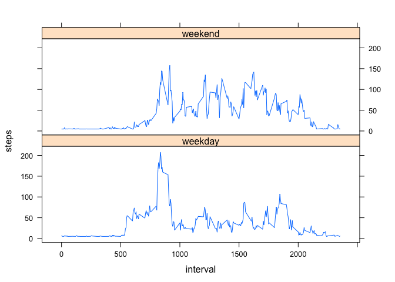

# Reproducible Research: Peer Assessment 1


## Loading and preprocessing the data

```r
data <- read.csv('./activity.csv')
# Convert date column to POSIX
data$date <- as.POSIXct(data$date)
```

## What is mean total number of steps taken per day?


```r
data.by_date <- aggregate(steps ~ date, data=data, FUN=sum)
data.by_date.mean <- mean(data.by_date$steps, na.rm=TRUE)
data.by_date.median <- median(data.by_date$steps, na.rm=TRUE)
hist(data.by_date$steps, breaks=10,
     xlab="Total number of steps",
     main="Data with empty values")
```

 

Mean of total steps: 10766.19.  
Median of total steps: 10765.00.

## What is the average daily activity pattern?


```r
data.by_interval <- aggregate(steps ~ interval, data=data, FUN=mean)
data.by_interval.max <- subset(data.by_interval, steps == max(data.by_interval$steps), select=interval)

plot(data.by_interval$interval, data.by_interval$steps, type="l", 
     xlab="Interval",
     ylab="Average number of steps")
```

 

Interval #835 has on average highest number of steps.


## Imputing missing values

We fill missing values with average steps taken by that date.
If whole day has missing values, we fill it with global average of taken steps.


```r
filled <- data
filled.missing <- is.na(data$steps)
filled[filled.missing, "steps"] <- data.by_date[data[filled.missing,"date"], "steps"]
filled[is.na(filled$steps), "steps"] <- mean(data$steps, na.rm=TRUE)
```

Total number of missing values: 2304.


```r
filled.by_date <- aggregate(steps ~ date, data=filled, FUN=sum)
filled.by_date.mean <- mean(filled.by_date$steps, na.rm=TRUE)
filled.by_date.median <- median(filled.by_date$steps, na.rm=TRUE)
hist(filled.by_date$steps, breaks=10,
     xlab="Total number of steps per day",
     main="Data with filled values")
```

 

Mean of total steps: 10766.19.
Median of total steps: 10766.19.

After filling values:

* mean has not changed,
* median has changed by 1.19.

## Are there differences in activity patterns between weekdays and weekends?


```r
filled$day <- factor(
    weekdays(filled$date) %in% c("Saturday", "Sunday"),
    labels=c("weekday", "weekend")
)
filled.by_interval <- aggregate(steps ~ interval + day, data=filled, FUN=mean)

xyplot(steps ~ interval | day, data=filled.by_interval, type="l", layout=c(1,2))
```

 

From above plot we can see that on weekdays users makes most of activity between interval 700 and 1000 and much less later.  
On weekends this spike of activity is not so clear anymore.
